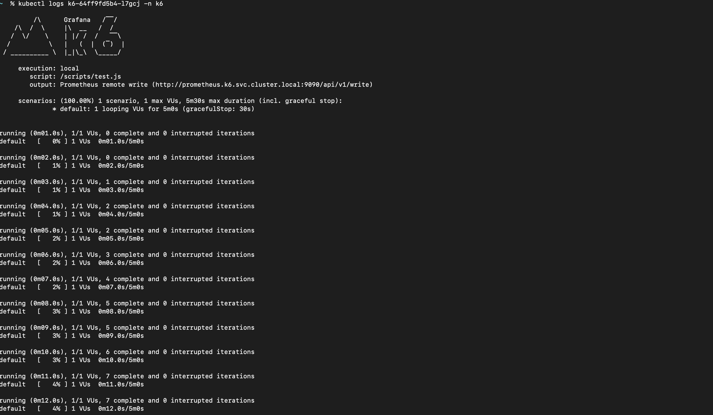
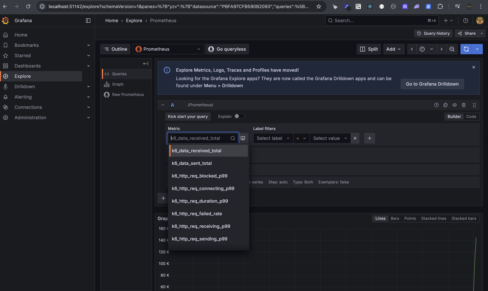
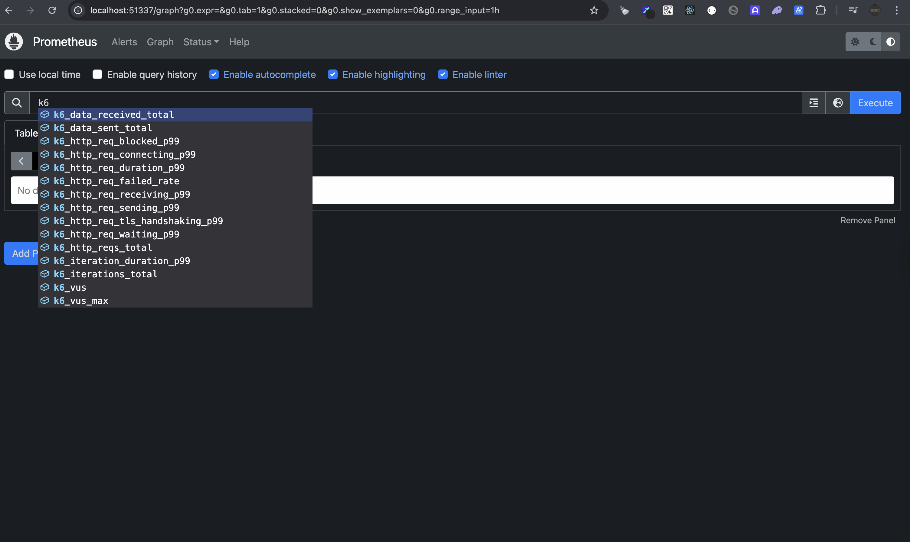
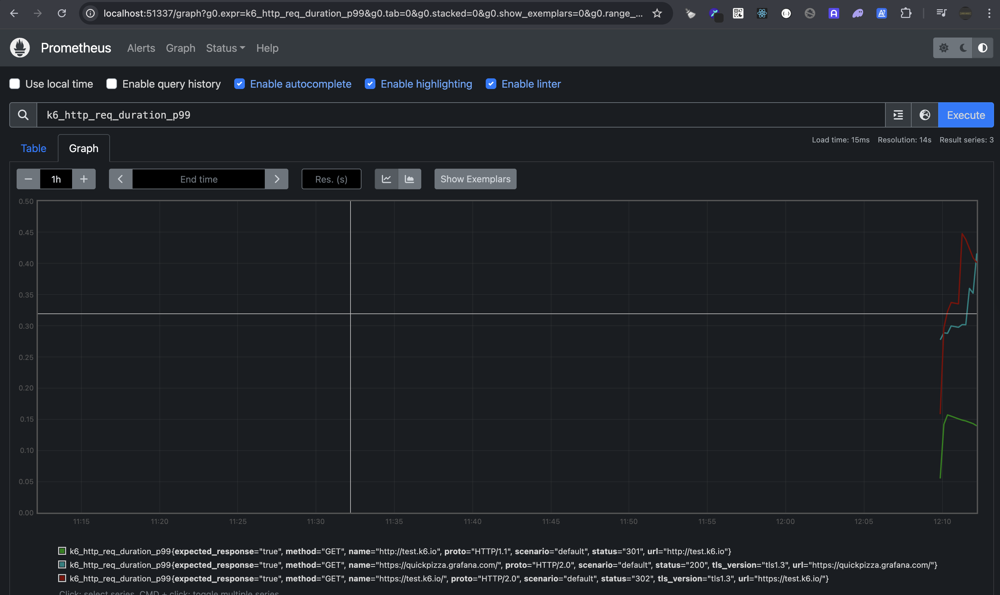
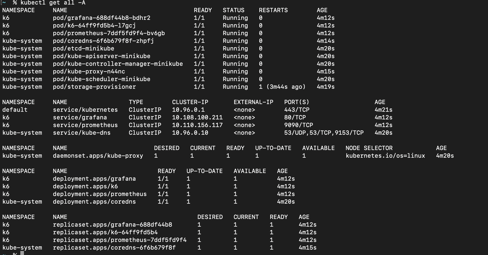

# k6 Load Testing Stack on Kubernetes with Helm

This project sets up a load testing environment using:

- k6 to run performance test scripts
- Prometheus to collect metrics using remote write
- Grafana to visualize the test results

All components are deployed using a single custom Helm chart (`k6-stack`).

## Directory Structure

```
k6-stack/
├── Chart.yaml
├── values.yaml
└── templates/
    ├── prometheus-configmap.yaml
    ├── prometheus-deployment.yaml
    ├── prometheus-service.yaml
    ├── grafana-deployment.yaml
    ├── grafana-service.yaml
    ├── k6-configmap.yaml
    └── k6-deployment.yaml
    └── grafana-datasource-config.yaml
```

## Prerequisites

- Kubernetes cluster (Minikube recommended for local setup)
- Helm 3+
- kubectl CLI

## Deployment Steps

### 1. Start Minikube (optional)

```bash
minikube start
```

### 2. Clone this Repository

```bash
git clone https://github.com:turnere230/k6-stack.git
cd k6-stack
```

### 3. Install the Helm Chart

```bash
helm install k6-stack . -n k6 --create-namespace
```

## Components

### Prometheus

- Version: v2.47.2
- Exposed internally at `prometheus.k6.svc.cluster.local:9090`
- Launched with the `--web.enable-remote-write-receiver` flag

### k6

- Executes a test script loaded via a Kubernetes ConfigMap
- Pushes metrics to Prometheus using remote write:
  ```
  http://prometheus.k6.svc.cluster.local:9090/api/v1/write
  ```

### Grafana

- Exposed via ClusterIP on port 80
- Access it using:
  ```bash
  minikube service -n k6 grafana
  ```
- Add Prometheus as a data source with URL:
  ```
  http://prometheus.k6.svc.cluster.local:9090
  ```

## k6 Test Script Example

```javascript
import http from 'k6/http';
import { sleep } from 'k6';

export const options = {
  vus: 1,
  duration: '5m',
};

export default function () {
  http.get('http://test.k6.io');
  sleep(1);
}
```

This script is stored in a ConfigMap and mounted into the k6 container.

## Grafana Setup

1. Open Grafana using `minikube service -n k6 grafana`
2. Add Prometheus as a data source
3. Import a dashboard (e.g. k6 dashboard ID 2587) or create your own
4. Query available metrics

## Uninstall

```bash
helm uninstall k6-stack -n k6
kubectl delete namespace k6
```

## Future Improvements
- Support persistent storage for Prometheus and Grafana
- External access and authentication setup

## Screenshots







# k6-stack
